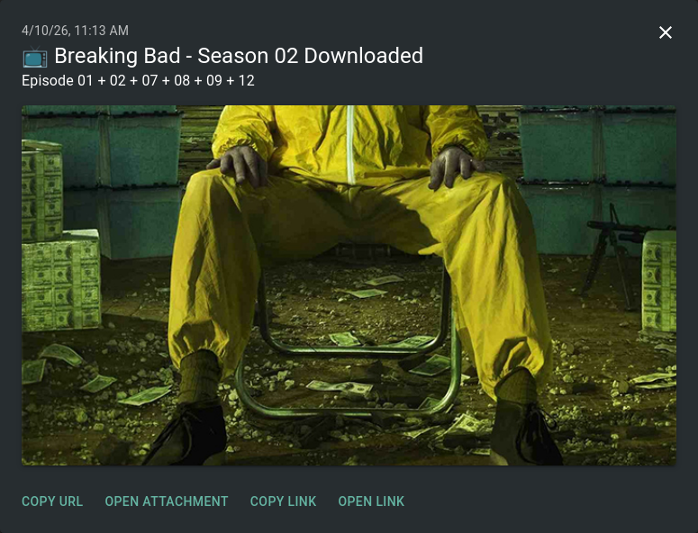
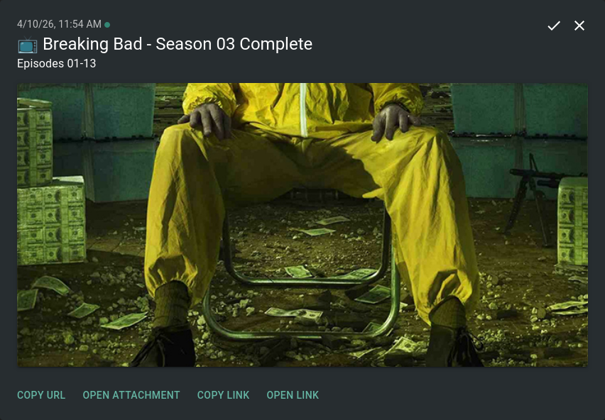

# Sonarr Season Notification Webhook

A small Flask service that receives Sonarr webhook events, buffers episode download notifications by season, and sends a single ntfy notification either after a timeout or immediately when a full season has been completed.

## What it does

This service listens for Sonarr webhook payloads on `/sonarr-webhook` and groups downloaded episodes by `series_id:season_number`.

Instead of sending one notification per episode, it buffers events for the same season, merges episode numbers into one message, and sends a single ntfy notification after `BUFFER_TIMEOUT` seconds or immediately when the whole season is present.

## Features

- Flask API with webhook and health endpoints.
- In-memory season buffering with debounce timers.
- Full-season detection using the Sonarr API.
- ntfy notifications with title, message, click URL, tags, and optional poster image.
- Title slug fallback if `titleSlug` is missing.
- Simple health check for buffers, timers, and Sonarr API key loading.
- Startup notification to ntfy when the app begins running.


## Endpoints

### `POST /sonarr-webhook`

Receives Sonarr webhook JSON payloads.

Behavior:

- Validates that JSON exists.
- Validates that a series ID exists.
- Extracts season and episode numbers.
- Buffers events by `series_id:season`.
- Checks Sonarr for the season's expected episode count.
- Flushes immediately if the season is complete.
- Otherwise resets a timer and waits for more episodes.

Example success response:

```json
{
  "status": "ok",
  "key": "123:1",
  "buffered": 4,
  "total_eps": 10,
  "event_type": "Download",
  "flush_now": false
}
```


### `GET /health`

Returns service status.

Example response:

```json
{
  "status": "ok",
  "buffers": 1,
  "timers": 1,
  "sonarr_api_loaded": true
}
```


## How notifications work

### Buffered season notification

If episodes arrive separately, the app stores them in a season buffer and waits for the debounce timer.

Example notification:

- Title: `Breaking Bad - Season 02 Downloaded`
- Message: `Episode 01 + 02 + 07 + 08 + 12`



### Full season notification

If the app sees that all episodes from episode 1 through the season total are present, it sends a complete-season notification immediately.

Example notification:

- Title: `Breaking Bad - Season 03 Complete`
- Message: `Episodes 01-13`




### Startup notification

When the app starts, it sends one ntfy system notification indicating that the service is up and listening for webhooks.

Example startup notification:

- Title: `Sonarr Season Webhook started`
- Message: `Application is up and listening for Sonarr webhook events.`
- Tags: `tv,system`


## Environment variables

Create a `.env` file like this:

```env
SONARR_URL="http://your_host:8989"
SONARR_API="random_api"

SONARR_LINK="http://your_host:8989" or "your_sonarr.domain.com"
NTFY_URL="http://your_host:8660"
NTFY_TOPIC="your_topic"

BUFFER_TIMEOUT="600"

HOST="0.0.0.0"
PORT="5000"
```


### Variable reference

| Variable | Required | Description                                                              |
| :-- | :-- |:-------------------------------------------------------------------------|
| `SONARR_URL` | Yes | Base URL for your Sonarr instance, without trailing slash.               |
| `SONARR_API` | Yes | Sonarr API key used to fetch series and season statistics.               |
| `SONARR_LINK` | Yes | Base URL for your Sonarr used in the ntfy click link.                    |
| `NTFY_URL` | Yes | Base URL for your ntfy server.                                           |
| `NTFY_TOPIC` | Yes | ntfy topic where notifications are published.                            |
| `BUFFER_TIMEOUT` | Yes | Number of seconds to wait before flushing a partial season notification. |
| `HOST` | Yes | Flask bind host.                                                         |
| `PORT` | Yes | Flask bind port.                                                         |


## Installation

### 1. Create a virtual environment

```bash
python3 -m venv .venv
source .venv/bin/activate
```


### 2. Install dependencies

```bash
pip install -r requirements.txt
```


## Running the app

```bash
python sonarr_ntfy.py
```

On startup, the app will:

- Load environment variables from `.env`.
- Send a startup notification to ntfy.
- Start Flask on the configured host and port.


## Sonarr webhook setup

In Sonarr:

1. Go to **Settings** > **Connect**.
2. Add a new **Webhook** connection.
3. Set the URL to your Flask service:
```text
http://YOUR_SERVER_IP:5000/sonarr-webhook
```

4. Enable the events you want Sonarr to send, typically download-related events.
5. Save and test.

## Example workflow

If Sonarr downloads these episodes for season 1:

- Episode 1 at 10:00
- Episode 2 at 10:03
- Episode 3 at 10:08

The app keeps buffering them under the same season key.

If `BUFFER_TIMEOUT=600`, it waits up to 10 minutes after the latest event before sending one consolidated notification.

If all episodes for the season are eventually detected before the timer expires, it sends a complete-season message immediately.

## Health checks and debugging

Useful routes and logs:

- `GET /health` for runtime state.
- Startup logs show whether the Sonarr API key is loaded.
- Flush logs indicate empty buffers, duplicate skips, and ntfy success or failure.


## Possible improvements

- Add explicit validation for required environment variables.
- Add structured logging instead of `print()`.
- Persist timers or move buffering into a task queue for better resilience.
- Add Docker support.
- Add unit tests for episode merging and full-season detection.
- Filter on specific Sonarr event types if you only want import or download notifications.


## License

MIT